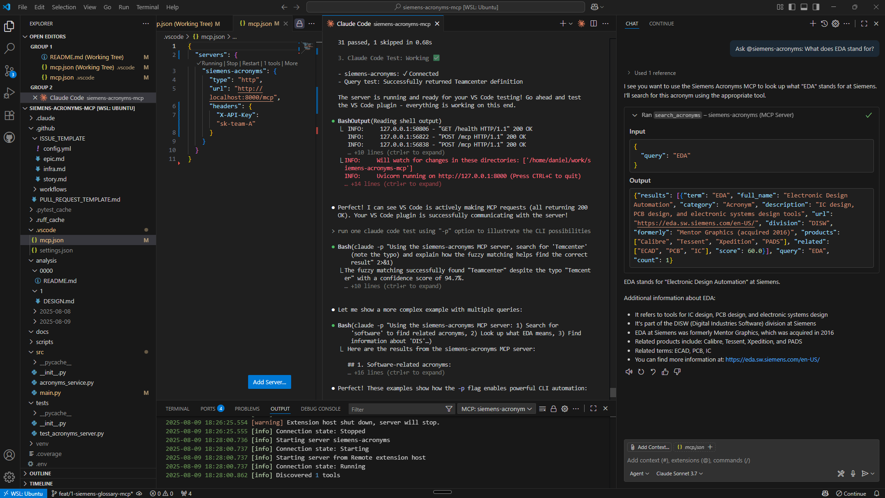

# Siemens Acronyms MCP Server

## 📚 Dual Purpose Project

This repository serves two important audiences:

### **1. MCP Server Example** 
For developers adding MCP (Model Context Protocol) to existing REST APIs without separate server binaries. This demonstrates how to make institutional knowledge accessible to AI assistants and development tools.

### **2. Compound Engineering Scaffold** 
For developers adopting AI-assisted workflows with Claude Code and other AI tools. A complete project structure optimized for parallel task execution and AI orchestration.

🎬 **Watch the workflow**: [Compound Engineering with Claude Code](https://www.youtube.com/watch?v=ZVvW7PvVnnk) (15 min)  
📋 **Fork the scaffold**: See [SCAFFOLD_NOTES.md](./SCAFFOLD_NOTES.md) for reusing this structure

---

## 🏗️ The Method: Compound Engineering

This scaffold implements the workflow from Kieran Klaassen's [Claude Code: How Two Engineers Ship Like a Team of 15](https://www.youtube.com/watch?v=Lh_X32t9_po). 

Two engineers at Every shipped 6 features, 5 bug fixes, and 3 infrastructure updates in one week. How? By using GitHub issues + AI in a way that makes every line of code traceable to requirements.

### Why It Works for Enterprise Teams

- You already use GitHub/GitLab issues
- Everything is transparent: Issues → **[Kanban](https://github.com/users/dzivkovi/projects/3/views/1)** → PRs  
- No "vibe coding" - every change has a clear purpose
- No new tools to learn, just better use of existing ones

### Real Example: This Repository

Built entirely with this approach. Check our **[public Kanban board](https://github.com/users/dzivkovi/projects/3/views/1)** to see how PRs #7 and #9 went from issue to deployment.

### Learn More

- 📺 [Original video](https://www.youtube.com/watch?v=Lh_X32t9_po) (74K+ views)
- 📖 [Detailed article](https://every.to/source-code/how-i-use-claude-code-to-ship-like-a-team-of-five) by Every
- 🎬 [15-min demo](https://www.youtube.com/watch?v=ZVvW7PvVnnk) 
- 📋 My story: [SCAFFOLD_NOTES.md](./SCAFFOLD_NOTES.md)

---

## Overview

A glossary service exposing Siemens-specific terminology via REST API and MCP endpoints. This working example demonstrates modern MCP best practices that solve real integration problems.

## 🎯 See It In Action



*One MCP server, multiple AI assistants: The same Siemens glossary seamlessly integrates with Claude Code's CLI for automation and VS Code's GitHub Copilot for interactive development.*

## ✨ Key Features

- **Dual Protocol Support**: REST API for web apps, MCP for AI assistants
- **Fuzzy Search**: Handles typos like "Temcenter" → "Teamcenter" 
- **Multi-Client**: Works with Claude Code CLI, VS Code, and any MCP client
- **Hot Reload**: Update glossary without restarting server
- **Secure**: API key authentication for MCP endpoints
- **Fast**: <50ms response time with 1000+ terms

## 🎯 Why This MCP Implementation is Different

This server demonstrates **modern MCP best practices** that solve real integration problems:

### ✅ **No Azure AD Overhead**
- Simple API key management via `MCP_API_KEYS` environment variable
- Perfect for small teams who want to manage their own authentication
- No complex OAuth flows or enterprise identity provider setup required

### ✅ **VS Code Compatible Authentication**  
- Uses **HTTP 403 Forbidden** (not 401 Unauthorized) for invalid API keys
- Prevents "Dynamic Client Registration not supported" OAuth popup errors
- Maintains security without breaking the VS Code user experience

### ✅ **Proper FastMCP Usage**
- Actually uses `@mcp.tool()` decorators (doesn't define them and ignore them)
- Clean 150-line implementation vs typical 300+ line manual JSON-RPC handling
- FastMCP handles all protocol details automatically

### ✅ **Production Ready**
- Middleware-based authentication with proper error handling
- Separate service modules for clean code organization
- Comprehensive test coverage with modern pytest patterns

## 🚀 Quick Start

### Prerequisites

- Python 3.10 or higher
- pip package manager
- FastMCP 2.11.2 or higher (older versions have different API)

**Prerequisites Check:**
```bash
# Verify Python version (should be 3.10+)
python --version

# Verify pip is installed and recent
python -m pip --version

# Upgrade pip to latest (recommended)
python -m pip install --upgrade pip
```

### Installation

1. **Clone the repository**
   ```bash
   git clone <repository-url>
   cd siemens-acronyms-mcp
   ```

2. **Set up Python virtual environment**
   ```bash
   python -m venv venv
   source venv/bin/activate  # On Windows: venv\Scripts\activate
   python -m pip install --upgrade pip
   pip install -r requirements.txt
   ```

   **Verify Installation:**
   ```bash
   # Check FastMCP version (should be 2.11.2+)
   python -c "import fastmcp; print(f'FastMCP version: {fastmcp.__version__}')"
   
   # Verify all dependencies installed
   python -c "import fastapi, starlette, rapidfuzz; print('All dependencies OK')"
   ```

3. **Configure environment variables**
   ```bash
   cp .env.example .env
   ```
   
   Edit `.env` and add your API keys:
   ```env
   # Comma-separated list of API keys for MCP endpoint authentication
   MCP_API_KEYS=sk-team-A,sk-team-B,sk-Daniel
   
   # Optional: Custom path to acronyms file
   # GLOSSARY_FILE_PATH=siemens_acronyms.json
   
   # Optional: Log level (DEBUG, INFO, WARNING, ERROR)
   LOG_LEVEL=INFO
   ```

4. **Run the server**
   ```bash
   uvicorn src.main:app --reload --port 8000
   ```

   The server will be available at http://localhost:8000

### Quick Test Your Setup

After starting the server, verify everything is working:

```bash
# Test 1: Health endpoint
curl http://localhost:8000/health
# Expected: {"status":"healthy","hostname":"...","uptime":...,"version":"1.0.0"}

# Test 2: REST API search
curl "http://localhost:8000/api/v1/search?q=EDA"
# Expected: Results with EDA definition

# Test 3: Fuzzy search (handles typos)
curl "http://localhost:8000/api/v1/search?q=Temcenter"
# Expected: Returns "Teamcenter" with ~94% match score

# Test 4: MCP via Claude Code (if configured)
claude -p "Using the siemens-acronyms MCP server, what does DISW mean?"
# Expected: Returns DISW definition
```

### What's Included

```
siemens-acronyms-mcp/
├── src/
│   ├── main.py              # FastAPI server (150 lines, clean & focused)
│   ├── mcp_service.py       # MCP tools using proper @mcp.tool() decorators  
│   ├── auth_middleware.py   # HTTP 403 auth (VS Code compatible)
│   └── acronyms_service.py  # Fuzzy search engine with file watching
├── tests/
│   └── test_acronyms_server.py  # Modern pytest test suite
├── siemens_acronyms.json    # Glossary data (3 samples, add more!)
├── .vscode/
│   ├── mcp.json            # VS Code MCP configuration (works without OAuth!)
│   └── settings.json       # Development settings
├── .claude/
│   └── settings.json       # Claude Code permissions
└── assets/
    └── MCP_demo_*.png      # Working demo screenshot
```

## 📡 API Endpoints

### 1. REST API (Public Access)

**Search Endpoint:** `GET /api/v1/search?q={query}`

No authentication required. Returns acronym definitions with fuzzy matching.

```bash
# Search for an exact acronym
curl "http://localhost:8000/api/v1/search?q=EDA"

# Fuzzy search handles typos
curl "http://localhost:8000/api/v1/search?q=Temcenter"
# Returns: Teamcenter (with similarity score)

# Partial matches
curl "http://localhost:8000/api/v1/search?q=Sim"
# Returns: Simcenter and related terms
```

**Response format:**
```json
{
  "results": [
    {
      "term": "EDA",
      "full_name": "Electronic Design Automation",
      "description": "IC design, PCB design, and electronic systems design tools",
      "score": 100.0
    }
  ],
  "query": "EDA",
  "count": 1
}
```

### 2. MCP Endpoint (Protected)

**Endpoint:** `POST /mcp`

Requires `X-API-Key` header with valid API key from `MCP_API_KEYS` (except for the `get_health` tool).

**📝 Important**: This implementation uses **HTTP 403 Forbidden** for authentication failures (not 401 Unauthorized). This prevents VS Code from triggering OAuth popups and maintains a smooth user experience while keeping your data secure.

**Available MCP Tools:**

1. **`search_acronyms`** - Search for Siemens acronyms and terminology
   - Parameters: `query` (string, required)
   - Returns: Matching terms with fuzzy search support
   - Authentication: Required

2. **`get_health`** - Get server health status
   - Parameters: None
   - Returns: Server status, hostname, uptime, and version
   - Authentication: Not required (public tool)

```bash
# List available tools
curl -X POST http://localhost:8000/mcp \
  -H "X-API-Key: sk-team-A" \
  -H "Content-Type: application/json" \
  -d '{"jsonrpc": "2.0", "method": "tools/list", "id": 1}'

# Search using MCP protocol (requires authentication)
curl -X POST http://localhost:8000/mcp \
  -H "X-API-Key: sk-team-A" \
  -H "Content-Type: application/json" \
  -d '{
    "jsonrpc": "2.0",
    "method": "tools/call",
    "params": {
      "name": "search_acronyms",
      "arguments": {"query": "DISW"}
    },
    "id": 2
  }'

# Get health status via MCP (no authentication required)
curl -X POST http://localhost:8000/mcp \
  -H "Content-Type: application/json" \
  -d '{
    "jsonrpc": "2.0",
    "method": "tools/call",
    "params": {
      "name": "get_health",
      "arguments": {}
    },
    "id": 3
  }'
```

### 3. Health Check

**Endpoint:** `GET /health`

```bash
curl http://localhost:8000/health
```

Returns:
```json
{
  "status": "healthy",
  "hostname": "your-hostname",
  "uptime": 123.45,
  "version": "1.0.0"
}
```

### 4. API Documentation

Interactive Swagger UI available at: http://localhost:8000/docs

## 🤖 Connecting AI Assistants via MCP

### Claude Code Integration

After starting the server, you can connect Claude Code to use the acronyms service:

1. **Add the MCP Server**
   ```bash
   # Add the MCP server with HTTP transport and API key
   claude mcp add --transport http siemens-acronyms http://localhost:8000/mcp \
     --header "X-API-Key: sk-team-A"
   
   # Verify connection status (should show ✓ Connected)
   claude mcp list
   ```

2. **Option 2: Manual Configuration in `.mcp.json`**
   
   Create or edit `.mcp.json` in your project directory (for local scope) or use `claude mcp add --scope project` for team sharing:
   ```json
   {
     "mcpServers": {
       "siemens-acronyms": {
         "type": "http",
         "url": "http://localhost:8000/mcp",
         "headers": {
           "X-API-Key": "sk-team-A"
         }
       }
     }
   }
   ```
   
   Or with environment variable expansion:
   ```json
   {
     "mcpServers": {
       "siemens-acronyms": {
         "type": "http",
         "url": "http://localhost:8000/mcp",
         "headers": {
           "X-API-Key": "${MCP_API_KEY:-sk-team-A}"
         }
       }
     }
   }
   ```

3. **Verify Configuration**
   ```bash
   # List configured MCP servers
   claude mcp list
   
   # Get details of the siemens-acronyms server
   claude mcp get siemens-acronyms
   ```

4. **Interactive Usage in Claude Code**
   
   After configuration, in Claude Code you can ask:
   - "What does DISW mean in Siemens context?"
   - "Search for EDA in the Siemens glossary"
   - "Find information about Teamcenter"
   - "Use the siemens-acronyms MCP server to search for TeamCenter"

5. **Non-Interactive Usage (Command Line)**
   
   Use the `-p` flag for non-interactive queries, perfect for scripts and automation:
   
   ```bash
   # Basic search
   claude -p "Using the siemens-acronyms MCP server, what does DISW mean?"
   
   # Test fuzzy matching (handles typos)
   claude -p "Using the siemens-acronyms MCP server, search for 'Temcenter'"
   # Returns: Teamcenter with 94.74% match score
   
   # Search by partial terms
   claude -p "Using the siemens-acronyms MCP server, search for 'software'"
   # Returns: DISW and other software-related acronyms
   
   # With permission bypass for automation
   claude -p --dangerously-skip-permissions \
     "Using the siemens-acronyms MCP server, what does EDA stand for?"
   ```
   
   **Note**: Claude Code will request permission to use MCP tools on first use. Either:
   - Grant permission interactively when prompted
   - Use `--dangerously-skip-permissions` flag for scripts (use cautiously)
   - Configure allowed tools in `.claude/settings.json`

### VS Code with GitHub Copilot Chat

VS Code v1.103+ includes native MCP support integrated with GitHub Copilot Chat.

#### Setup Instructions

**Important for WSL2/Windows Users**: If running VS Code on Windows with the server in WSL2, use the User Configuration method below.

1. **Start the MCP server** (in WSL2 or terminal):
   ```bash
   uvicorn src.main:app --reload --port 8000
   ```

2. **Configure in VS Code** (choose one method):
   
   **Method A: Via UI (Easier)**
   - Open Command Palette (`Ctrl+Shift+P`)
   - Run: `MCP: Add Server`
   - Enter server details when prompted
   - VS Code will save configuration automatically
   
   **Method B: Edit Configuration File**
   - Open Command Palette (`Ctrl+Shift+P`)
   - Run: `MCP: Open User Configuration`
   - Add this configuration:
   ```json
   {
     "servers": {
       "siemens-acronyms": {
         "type": "http",
         "url": "http://localhost:8000/mcp",
         "headers": {
           "X-API-Key": "sk-team-A"
         }
       }
     }
   }
   ```
   - Save and reload VS Code

3. **Start and verify the server**:
   - Command Palette → `MCP: Show Installed Servers`
   - Click "Start" next to `siemens-acronyms`
   - Should show "Running" status

4. **Use in GitHub Copilot Chat**:
   - Open Copilot Chat (`Ctrl+I`)
   - Switch to "Agent" mode (click agent icon)
   - Test: "What does DISW mean?"
   - The tool `search_acronyms` will be invoked automatically

**Note**: Windows automatically forwards `localhost:8000` from WSL2, so no special network configuration is needed.


## 🔍 Real-World Usage Examples

Based on practical testing with Claude Code, here are actual results:

### Fuzzy Matching in Action
```bash
# Typo in "Teamcenter" → Still finds the right result
$ claude -p --dangerously-skip-permissions \
    "Using siemens-acronyms MCP, search for 'Temcenter'"
> Found "Teamcenter" with 94.74% confidence score

# Partial word matching
$ claude -p --dangerously-skip-permissions \
    "Using siemens-acronyms MCP, search for 'software'"
> Found DISW (Digital Industries Software) with 84% match
```

### Understanding MCP Communication
Each Claude Code query triggers multiple MCP calls:
1. `initialize` - Protocol handshake
2. `tools/list` - Discover available tools
3. `tools/call` - Execute the search
4. Server logs show all requests with 200 OK status

### Performance Observations
- Response time: <50ms for typical queries
- Connection overhead: ~100ms for initial handshake
- Fuzzy matching adds negligible latency (<10ms)

## 🧪 Testing

Run the comprehensive test suite:

```bash
# Run all tests
pytest -v

# Run with coverage report
pytest -v --cov=src

# Run specific test categories
pytest -v tests/test_acronyms_server.py::TestRESTEndpoint
pytest -v tests/test_acronyms_server.py::TestMCPEndpoint
```

Current test coverage: **83%** with 31 tests passing.

## 🔧 Development

### Project Structure
```
siemens-acronyms-mcp/
├── src/
│   ├── main.py              # FastAPI application
│   └── acronyms_service.py  # Core search service
├── tests/
│   └── test_acronyms_server.py  # Test suite
├── siemens_acronyms.json    # Glossary data (hot-reloadable)
├── requirements.txt         # Python dependencies
├── .env.example            # Environment template
└── README.md              # This file
```

### Adding New Acronyms

Edit `siemens_acronyms.json`:

```json
{
  "acronyms": [
    {
      "term": "NEW_TERM",
      "full_name": "Full Name of Term",
      "category": "Acronym",
      "description": "Description of what this term means",
      "division": "DISW",
      "url": "https://optional-url.com",
      "related": ["RELATED1", "RELATED2"]
    }
  ]
}
```

The service automatically reloads the file without restart.

### Code Quality

Before committing:

```bash
# Format code
ruff format .

# Check linting
ruff check . --fix

# Run tests
pytest -v
```

## 🚦 Deployment

### Production Deployment

1. **Using Uvicorn directly**
   ```bash
   uvicorn src.main:app --host 0.0.0.0 --port 8000 --workers 4
   ```

2. **Using Gunicorn with Uvicorn workers**
   ```bash
   gunicorn src.main:app -w 4 -k uvicorn.workers.UvicornWorker --bind 0.0.0.0:8000
   ```

3. **Docker deployment**
   ```dockerfile
   FROM python:3.10-slim
   WORKDIR /app
   COPY requirements.txt .
   RUN pip install -r requirements.txt
   COPY . .
   CMD ["uvicorn", "src.main:app", "--host", "0.0.0.0", "--port", "8000"]
   ```

### Environment Variables

| Variable | Description | Default | Required |
|----------|-------------|---------|----------|
| `MCP_API_KEYS` | Comma-separated API keys for MCP auth | - | Yes (for MCP) |
| `GLOSSARY_FILE_PATH` | Path to acronyms JSON file | `siemens_acronyms.json` | No |
| `LOG_LEVEL` | Logging level | `INFO` | No |

## 📊 Performance

- **Search response time**: <100ms for 1000+ terms
- **Concurrent requests**: Handles 50+ simultaneous connections
- **Memory usage**: ~50MB with 1000 terms loaded
- **Hot reload**: File changes detected within 1 second

## 🤝 Contributing

1. Check existing issues or create new ones
2. Follow TDD approach - write tests first
3. Ensure all tests pass and code is formatted
4. Update `siemens_acronyms.json` for new terms
5. Create pull request with clear description

## 📄 License

- **Source Code**: MIT License - Use freely in your projects
- **Glossary Data**: CC BY 4.0 - Share and adapt with attribution

This dual licensing allows both internal Siemens use and external contributions.

## 🆘 Troubleshooting

### Server won't start
- Check Python version: `python --version` (needs 3.10+)
- Verify all dependencies: `pip install -r requirements.txt`
- Check port availability: `lsof -i :8000`

### MCP endpoint returns 401
- Verify API key in `.env` file
- Check `X-API-Key` header in request
- Ensure no spaces in `MCP_API_KEYS` value

### Search returns no results
- Check `siemens_acronyms.json` file exists and is valid JSON
- Verify file permissions allow reading
- Check logs for file loading errors

### Claude Code can't connect
- Ensure server is running: `curl http://localhost:8000/health`
- Verify API key matches between server and client config
- Check firewall/network settings allow localhost connections
- Protocol version issue: Claude Code uses `"2025-06-18"` protocol version
  - The server automatically echoes back the client's requested version
  - If you see connection success but tools don't work, restart Claude Code

## 📞 Support

For issues or questions:
1. Check the [Issues](https://github.com/dzivkovi/siemens-acronyms-mcp/issues) page
2. Review test files for usage examples
3. Consult `CLAUDE.md` for AI assistant guidance

---

**Note**: This is a demonstration project showing how to MCP-enable internal glossaries and APIs. The patterns shown here can be applied to other internal services to make them accessible to AI assistants while maintaining security through API key authentication.